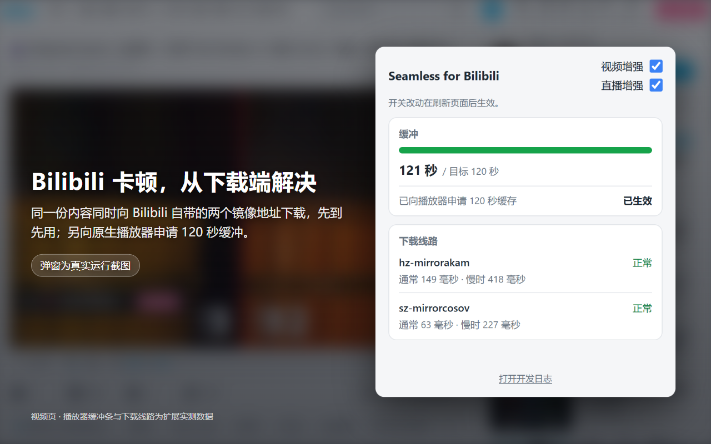
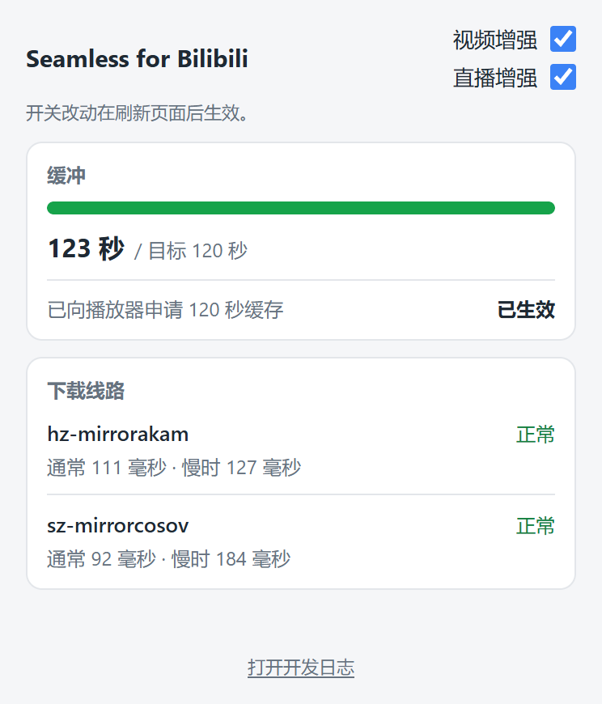

# Bilibili 桌面网页抗卡

缓解 Bilibili 视频与直播卡顿的 Chrome 扩展。独立第三方工具，与 Bilibili 无隶属或合作关系；Bilibili 及相关名称归其权利人所有。

**简体中文**（本文件） | **English**：[README.en.md](README.en.md)

长期产品约束见 [GOAL.md](GOAL.md)，隐私政策见 [PRIVACY.md](PRIVACY.md)，上架材料在 [store/](store/README.md)。

## 这是什么、给谁用

你在 Bilibili 看视频或直播时经常卡一下，而自己的测速并不慢，本扩展为这种场景设计。它接管播放器的媒体下载：同一份内容同时从 Bilibili 自带的两个镜像地址下载，先到先用；视频页另向原生播放器申请 120 秒缓冲。视频与直播都支持。

它不接管播放：播放、暂停、拖动、倍速、画质、音量与音视频轨的选择仍由你和 Bilibili 播放器决定，扩展不改写、不替换任何 Bilibili 地址。

## 前提假设与局限

三个前提：

1. 卡顿常来自 Bilibili 个别 CDN 节点慢或不稳定，而不是你自己的网络；
2. Bilibili 自己的播放信息（playurl）已经为同一份内容给出主备多个镜像地址；
3. 你的带宽高于视频码率，有余量同时下载两份。

它救「慢节点」，救不了「慢线路」：家庭带宽本身不足时帮不上忙，缓冲持续变浅、最终停顿，这种停顿它无法消除。浏览器解码侧造成的卡顿（缓冲已满仍然卡住，例如硬件解码断供）也不在它的能力范围内。

标签页转入后台后 Chrome 停掉视频解码、只留音频，这是浏览器省电行为，扩展不改变也不绕过（见下方[浏览器后台行为](#浏览器后台行为)）。

## 怎么工作

**视频页**（`/video/*` 与 `/list/watchlater*`，两个路由同一套增强）：接管播放器的媒体分片下载（`fetch` 与 XHR 两条通道）。每个 1 MiB 分片同时向 Bilibili 提供的两个镜像地址请求，先完整到达的存入内存并回应播放器，另一路取消；向前预取（窗口最多 48 个分片、并发上限 4）；分片只存内存（每个标签页上限 512 MiB），离开视频路由或关闭页面即释放，不落盘；每次出现新的播放器或媒体内容时，向原生播放器请求一次 120 秒稳定缓冲。

**直播页**（live.bilibili.com）：接管播放器的 FLV 直播流。只配对同一集群的主备两路地址（如 07 对 07b），先比对两路开头的字节一致，再两路同时下载、先到的字节先交给播放器；查无配对或比对不一致时退回播放器原地址单路接管。直播不预取、不设缓冲目标。

两者的下载层失败都会显式报告，不静默退回原生下载。权威行为规格（中文）见下方[下载层](#下载层)；产品约束见 [GOAL.md](GOAL.md)。

## 代价：流量是第一位的

按流量套餐衡量再决定装不装：

- **视频竞速浪费**：竞速中落败一路已下载的字节被丢弃。一次实测稳态浪费约 12.6%（每场播放不同；日志页的 CDN 竞速面板显示当场实际浪费率）。
- **直播接近两倍流量**：配对后两路一直同时下载，流量接近单路的两倍。
- **提前下载**：120 秒缓冲目标与预取会把还没看到的数据先下载；提前离开视频页，这些字节就白下了。
- **内存**：每个标签页的媒体缓存最多约 512 MiB。
- **磁盘**：本地诊断日志按设计不轮转、不设上限，随使用持续增长（开发者自用浏览器实测：视频页每打开 1 小时约 7 MB）；卸载扩展即全部删除。
- **开关**：弹窗里的「视频增强」开关只作用于视频页（刷新后生效）；直播页的接管今天没有单独开关；不想承担直播的双倍流量，请在 chrome://extensions 停用本扩展。



## 弹窗（popup）怎么读

弹窗只读、只显示观测事实，不影响播放、不上传：

- **缓冲**：一条缓冲条和「已缓冲 N 秒 / 目标 120 秒」。数值是覆盖当前播放点的连续可播放前向秒数，不是整段视频的缓冲；条到头（120 秒）变绿。
- **120 秒申请状态**：向播放器申请 120 秒缓存的结果，分为已生效 / 等待生效 / 播放器不支持 / 申请失败四种。
- **下载线路**：本次播放实际用到的每条 CDN 线路（通常两条），每条一个健康词（正常 / 有停滞 / 有错误 / 尚无数据）和连接时间（「通常 X 毫秒 · 慢时 Y 毫秒」，分别是该线路首字节耗时的 P50 与 P90）。
- **直播页**同一风格：同样的下载线路卡片，加一行直播接管状态（正在按两条线路竞速下载 / 单路接管（无可用备用线路）/ 接管请求失败 / 未接管（未发现 FLV 直播流）/ 等待直播数据）；直播没有缓冲条。
- 不是正在播放的页面：卡片收起，只留一句友好提示。



## 安装

**Chrome Web Store**：上架准备中；完成后这里会放商店链接，在那之前请勿相信任何冒称本扩展的安装页。

**从源码加载（未打包）**：需要 Node.js 20+ 与 Chrome/Chromium 120+。

```sh
npm ci
npm run build
```

在 `chrome://extensions` 开启开发者模式，选择 `dist/extension` 加载。仓库已提交可直接加载的 `dist/extension`；源码更新后重新构建并在扩展页点「重新加载」，再刷新已打开的 Bilibili 页面。

## 隐私

数据不离开本机：媒体分片只在内存中转，诊断日志只存在扩展自己的本地数据库，没有上传、遥测或任何外部端点。扩展只申请 `storage` 与 `unlimitedStorage` 两个权限，没有 `tabs`、`downloads` 或 host permission。完整政策见 [PRIVACY.md](PRIVACY.md)（双语）。

## 常见问题

**装了就一定不卡吗？**
不是。它针对「个别 CDN 节点慢」这一类卡顿；自家带宽不足或浏览器解码跟不上时无能为力（见[前提假设与局限](#前提假设与局限)）。

**为什么后台标签页音频还在放、画面不动？**
Chrome 对后台标签页停止视频解码（background video track optimization）。切回前台时是页面自己重建播放器，帧计数重新从零开始、缓冲余量塌落后重新回填。这是浏览器行为，扩展不改变也不绕过；详见下方[浏览器后台行为](#浏览器后台行为)。

**缓冲条一直到不了 120 秒？**
说明带宽跟不上当前码率。扩展能做的是把带宽花在播放器真正需要的下载上，它不能让缓冲在慢线路上停止流失。

**直播能单独关掉吗？**
今天没有直播单独开关。不想承担直播双倍流量，请在 chrome://extensions 停用整个扩展。

**会动我的播放操作吗？**
不会。播放、暂停、拖动、倍速、画质、音量与轨道选择仍由你和播放器决定；弹窗只读。

**会上传什么数据？**
什么都不上传。详见 [PRIVACY.md](PRIVACY.md)。

## 反馈

问题与建议请到 GitHub Issues：https://github.com/chnlich/smooth-bilibili-chrome-plugin/issues

## 许可证

[MIT](LICENSE)。

---

以下为开发者文档。面向用户的内容到此为止；技术规格（下载层、面板行为、后台行为）以本文件中文版为权威来源，[README.en.md](README.en.md) 只作英文概述并链接到此处。

## 当前行为

- `/video/*` 与 `/list/watchlater*` 使用同一视频增强。扩展拦截视频页媒体分片请求，命中时从内存回应，未命中时由扩展取回覆盖请求的完整分片、入库后再回应；分片只在实例内存中保存，离开视频路由或页面关闭即释放，不落盘；仍只对当前原生播放器尝试一次 120 秒稳定缓存目标，并只读显示覆盖当前播放点的 `video.buffered` 连续区间。不接管播放，不调用 `play()`/`pause()`，不写播放位置、倍速、画质、音量、静音、source，也不改变播放器的清晰度、seek、播放暂停或音视频轨决策。
- popup 只显示视频增强开关和只读观测事实，不影响播放，不上传。

## 浏览器后台行为

标签页转入后台约 10 秒后，Chrome 会完全停止视频解码，只保留音频。这是 Chrome 的 background video track optimization：MSE 播放且含音轨、关键帧间隔小于 5 秒时，隐藏标签页的视频轨会被禁用以省电。实测（BV12hGK6bELA，系统 Chrome，专用 profile）：隐藏后 10.0 秒解码停止并持续 50 秒，其间 `getVideoPlaybackQuality().totalVideoFrames` 一帧不动、`droppedVideoFrames` 保持 0、`currentTime` 正常前进、`readyState` 恒为 4、缓冲余量 60–73 秒，且页面仍在向 SourceBuffer 追加数据。

视频轨被禁用这件事可以在 CDP 的 Media 域直接看到：隐藏后 10.6 秒出现一条 `kVideoTrackChange`，`video_track_selected` 变为 `unset`。

切回前台时是页面自己重建播放器，不是浏览器重建解码管线：页面换掉 `<video>` 元素、新建一个 MediaSource，再跳回原播放位置。因此 `totalVideoFrames` 归零重新计数（实测 938 → 97），`video.buffered` 覆盖当前播放点的余量从 69.3 秒塌到 11.5 秒后重新回填。

读诊断日志时据此判读：解码帧计数停住不等于故障，先看同一时刻附近的 `video.visibility_changed`。扩展不改变这一行为，也不试图绕过它。

## 下载层

- 识别为媒体分片且带闭合单段 `Range` 的请求一律由下载层拦截。命中时从内存中的完整分片切片回应，未命中时由扩展用同一 URL 和凭据取回覆盖范围的完整分片，入库后再回应播放器的原始 Range；播放器不会为这类媒体分片另行发起网络请求。非媒体请求、缺少 `Range`、非闭合 `Range`、同步 XHR、直播页非 FLV 媒体请求（`live_non_flv`），以及下载层自身的 `internal_fallback`/`internal_error` 路径仍按原样放行，并由 `bank.serve` 记录 `pass` 和原因（包括 `range_missing`、`range_not_closed`、`sync_xhr`、`live_non_flv`）。`bank.serve` 的命中事件记录 `mirror` 与 `durationMs`，`bank.fetch.chunk` 记录 `mirror`。
- 直播页（`live.bilibili.com`）只做下载接管与双路竞速，不做预拉、不设缓存目标。播放器在直播页发起的 `.flv` 长连接请求由扩展接管：首个此类请求到达时按需同步解析页面内嵌 `playurl_info`，并观察播放器自身的直播 `getRoomPlayInfo` 流量补充地址簿；只配同 cluster 主备两路（如 07 对 07b），跨 cluster 不配，地址不合成、不猜，URL 签名 `expires` 到期按地址失效处理。双腿 reader 并发累积，拼接窗口与前缀门窗口同按 `BANK_CONFIG.chunkBytes`（1 MiB）分窗：共同前缀比对一致才进入竞速交付，先达字节供给，败腿已读字节按既有浪费口径记录；竞速中重叠窗口持续比对，晚到不一致保领先腿、撤销另一腿；门期备腿停滞按单腿死处理，单腿死后余腿独跑、不重连。查无配对或前缀不一致时永久降级为播放器所名 URL 单腿接管（不制造播放故障）。双腿全灭、或签名到期且无新地址时显式失败，不静默退回原生。直播流事件按偏移分窗复用 `bank.fetch.chunk`（`chunkIndex` 为偏移对 `chunkBytes` 下取整，`slot` 标腿）与 `bank.serve`（`result`/`reason` 增 `live_stream`、`live_stream_unpaired`、`live_non_flv`），拼接裁决记 `live.stream.stitch`（`streamPath` 为去 query 的流路径、`bytesChecked` 为累计比对字节数、`mismatch`、`phase` 为 `prefix` 或 `stream`）。
- 预取窗口按媒体资源分别锚定在仍未供数完成的播放器请求所需的最小块号；没有在途请求时使用最近一次播放器请求的起始块。窗口最多覆盖 48 个块，并发上限 4，只选择窗口内尚未入库且连续失败未达 3 次的前四个块。失败块下一轮自然重新进入窗口，达到上限后向需要它的播放器请求报告错误。
- 每个块的扩展取数按 `raceLegs=2` 同时向 Bilibili 返回的主/备媒体地址发起双腿竞速，first-finish 的完整响应入库并返回播放器，败选腿已读字节是竞速固有成本；配对地址簿来自网络 playurl 响应，未配对时会按需读取页面内联 `window.__playinfo__`。
- 前台取数失败和下载层无法供数的异常会向 `console.error` 报告；预取失败由下一轮重试吸收并保留 `bank.fetch.chunk`，不输出 console；正常的停滞取消也不输出 console。
- 取数按 1 MiB 完整分片流式读取。连续 10 秒没有收到字节时取消并丢弃本次已读的半块；单纯耗时不会取消。文件总长度只从扩展自己的取数响应的 `Content-Range` 学习，不读取让路响应的 body 或 header。
- 分片只存在 `Map` 里，不落盘；内存上限 512 MiB。

## 面板与日志页可见行为

- popup 面向普通观众，只讲三件事：缓冲、下载线路、连接时间。视频页显示一条缓冲条和「已缓冲 N 秒 / 目标 120 秒」，数值是覆盖当前播放点的连续可播放前向秒数（`src/extension/popup.js:62-77`、`src/extension/popup-view.js`、`src/extension/readouts.js`）；下方一行报告向播放器申请 120 秒缓存的结果：已生效、等待生效、播放器不支持，或申请失败（`src/ui/panel.js`、`src/vod/controller.js` 的 `updateStatus`）。
- popup 的「下载线路」卡片按镜像列出本次播放实际用到的每条 CDN 线路（通常两条），每条给一个健康状况词（正常、有停滞、有错误、尚无数据）和连接时间（「通常 X 毫秒 · 慢时 Y 毫秒」，来自 `logs:cdn-summary` 的每镜像 TTFB P50/P90）（`src/extension/popup-view.js`、`src/diagnostics/cdn.js`、`src/diagnostics/worker.js`）。线路名是镜像主机名的可读短名。
- 直播页（live.bilibili.com）同一风格：同样的「下载线路」卡片，加一行直播接管状态（正在按两条线路竞速下载 / 单路接管（无可用备用线路）/ 接管请求失败 / 未接管（未发现 FLV 直播流）/ 等待直播数据），由内容侧折叠 `bank.serve` 事件得出；直播不设缓冲目标，popup 不显示缓冲条（`src/extension/popup-live.js`、`src/extension/popup-view.js`）。popup 的路由判定优先使用内容侧自报的 `routeKind`，因为 popup 没有 `tabs` 权限、读不到标签页地址（`src/diagnostics/client.js` 的 `getStatus`、`src/extension/readouts.js`）。
- popup 面板只读，不影响播放、不上传；内容侧错误只在存在时以一句人话显示，非 Bilibili 标签页或没有内容脚本的标签页只显示一句友好提示（`src/extension/popup.js`、`src/extension/popup-view.js`）。popup 底部保留「打开开发日志」入口，日志页本身不变。
- 所有 `media.*` 事件都附带同一帧周期聚合的 `frameTiming`，包括 presentedTotal、maxFrameGapMs、processingMs、displayLead、mediaStep 与 append 相关指标（`src/diagnostics/media.js`、`src/diagnostics/privacy.js:195-212`）。这些细节只进开发日志；popup 不再展示 readyState、networkState、轨道 ranges、库存计数或持久化状态等开发读数。
- 下载层库存只列出本次播放实际参与的分轨（`resourceState` 或 `chunks` 中出现过的资源），不展示地址簿里的所有表示（`src/bank/inventory.js:103-107`）；它作为 `bank.inventory` 诊断事件进入开发日志。
- 日志页提供 CDN 竞速面板，按镜像统计竞速进入、胜出、TTFB P50/P90、停滞与交付字节，并给出配对覆盖率与浪费字节率（`src/diagnostics/logs.js`、`src/diagnostics/worker.js`）。

## 构建

需要 Node.js 20+ 与 Chrome/Chromium 120+：

```sh
npm ci
npm run build
```

在 Windows 上运行真实 Chrome 测试时，在 Windows 侧的检出里安装依赖并构建（使用系统 Chrome，不下载 Playwright Chromium）：

```bat
cd /d <Windows 检出路径>
set "PLAYWRIGHT_SKIP_BROWSER_DOWNLOAD=1"
npm.cmd install
npm.cmd run build
```

构建保持未压缩，并为每个 JavaScript bundle 生成外部 source map。`buildId` 由 `src` 内容确定性生成；源码不变时连续构建的文件内容、文件列表和 build id 相同。

## 测试与验证

```sh
npm test
npm run smoke:external
npm audit --json
npm audit --omit=dev --json
```

现有确定性浏览器测试仍使用新建的临时 profile。所有自动化浏览器都保持 `--mute-audio` 和 document-start 静音 guard；真实 Bilibili 页面受环境阻挡时只报告 `BLOCKED`，不伪造通过。

浏览器脚本明确使用系统 Chrome（可执行文件可用 `BILIBILI_E2E_CHROME` 环境变量指定，默认取系统安装路径），不回退到 Playwright Chromium。`npm run test:e2e` 使用临时 profile；真实播放验收使用 `npm run verify:browser -- --profile <专用登录 profile> --bv <BV号>`。验证输出目录包含 `events.json`、`console.json`、`network.json` 和 `summary.json`；`summary.json` 会记录 commit sha、buildId，以及 `pass`、`fail` 或 `INCONCLUSIVE` 和失败项。

Playwright 启动的 Chrome 无法产生后台标签页：同窗口切换标签页、以及用 `Browser.setWindowBounds` 最小化窗口（已确认生效），页面都仍报 `visibilityState: 'visible'`，页面自身也收不到 `visibilitychange`；去掉 Playwright 默认传入的 `--disable-backgrounding-occluded-windows`、`--disable-renderer-backgrounding`、`--disable-background-timer-throttling` 三个参数亦无效。需要验证后台相关行为时，自行启动 Chrome 并用原生 CDP 驱动，通过 DevTools HTTP 端点的 `/json/activate/<targetId>` 切换标签页，并在每个阶段断言 `document.hidden`。

Chrome 不再单独接受 `--load-extension`。加载未打包扩展走 CDP `Extensions.loadUnpacked`，即 `scripts/install-unpacked-extension.mjs` 的做法。

## 自己验证

1. 执行 `npm run build` 后，在 `chrome://extensions` 加载 `dist/extension`。
2. 打开一个**播放量 1000 以下的冷门视频**（热门视频被 CDN 预热会掩盖问题）。
3. 在 popup 中打开开发日志页，观察：`bank.serve` 的 hit 及取数/回落结果、`bank.fetch.chunk` 的停滞/越过/放弃结果、有没有 `bank.disabled`。
